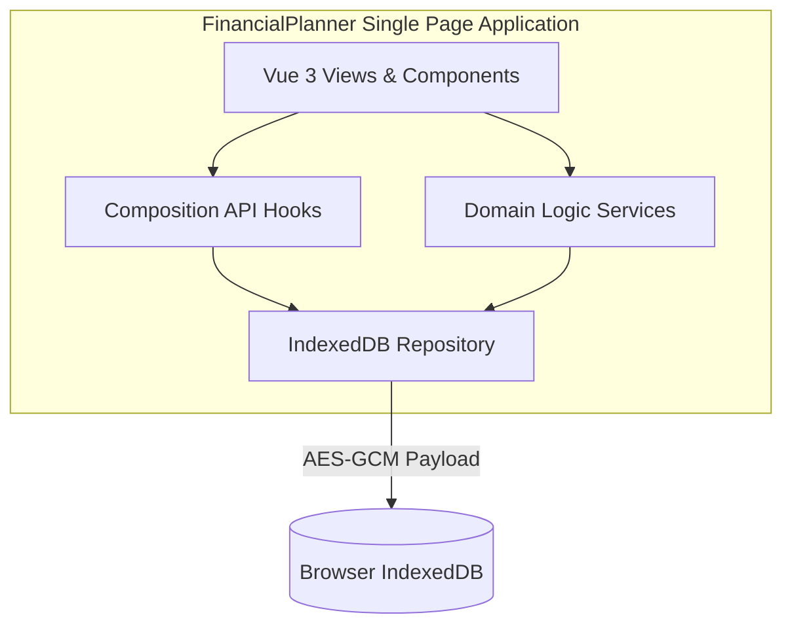
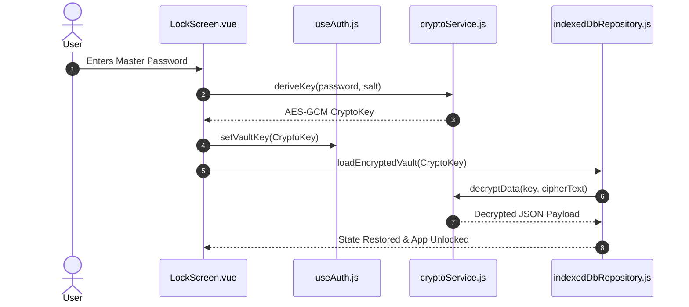

# Functional Design Document (FDD): FinancialPlanner

## 1. System Context Diagram (C4 Level 1)

---

## 2. Container Diagram (C4 Level 2)

---

## 3. Component Interactions & Sequence Flow

### 3.1 Vault Unlocking Sequence

---

## 4. Subsystem Functional Specifications

### 4.1 Compound Interest Calculation Engine
- **Module**: `src/services/financialCalculations.js`
- **Functions**: `calculateCompoundInterest`, `calculateRequiredMonthlyContribution`
- **Formula**:
  $$\text{Balance}_{m} = \text{Balance}_{m-1} \times (1 + r) + \text{PMT}_m$$
  where $\text{PMT}_m$ escalates annually by $(1 + \text{Increase}\%)$.

### 4.2 Loan & Installment Schedule Engine
- **Module**: `src/services/loanCalculations.js`
- **Functions**: `generateCreditCardInstallments`, `calculateCasualLoanSummary`, `calculateCreditLoanSummary`
- **Remainder Absorbance**: Floored base amounts are allocated across months, and division remainders are absorbed strictly into the final installment to avoid sub-cent floating point discrepancies.
