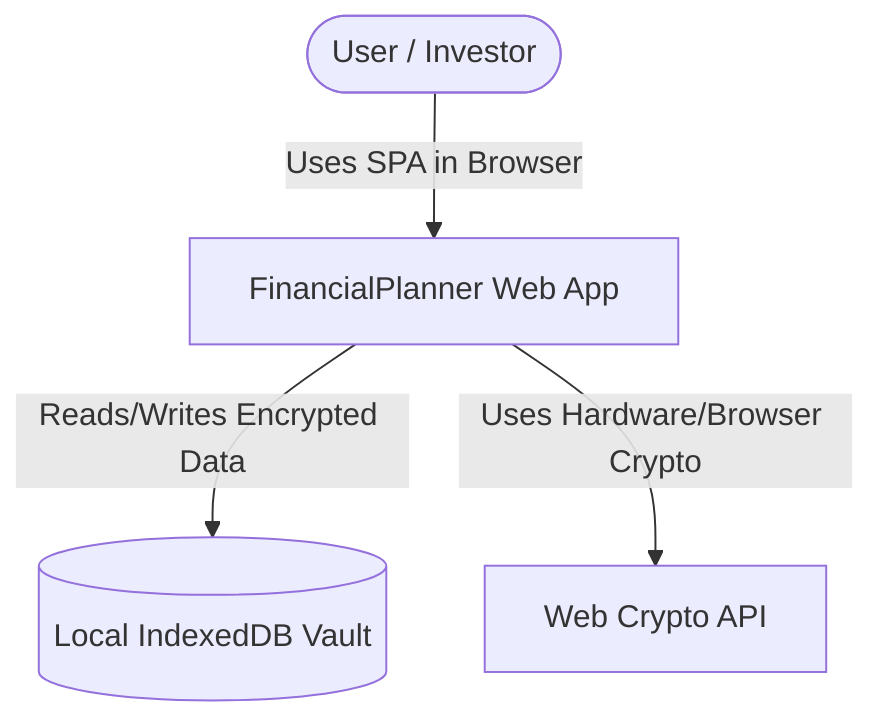
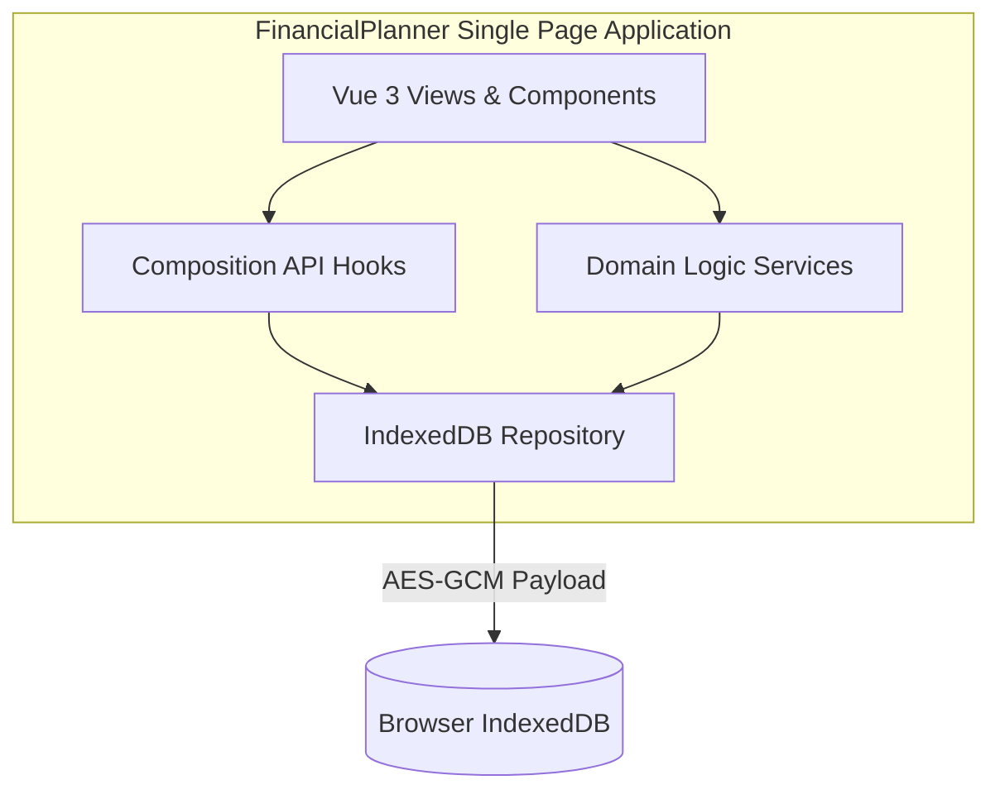
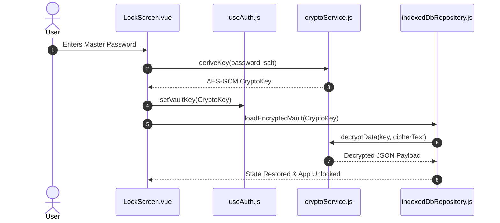

# Functional Design Document (FDD): FinancialPlanner

## 1. System Context Diagram (C4 Level 1)

---

## 2. Container Diagram (C4 Level 2)

---

## 3. Component Interactions & Sequence Flow

### 3.1 Vault Unlocking Sequence

---

## 4. Subsystem Functional Specifications

### 4.1 Compound Interest Calculation Engine
- **Module**: `src/services/financialCalculations.js`
- **Functions**: `calculateCompoundInterest`, `calculateRequiredMonthlyContribution`
- **Formula**:
  $$\text{Balance}_{m} = \text{Balance}_{m-1} \times (1 + r) + \text{PMT}_m$$
  where $\text{PMT}_m$ escalates annually by $(1 + \text{Increase}\%)$.

### 4.2 Loan & Installment Schedule Engine
- **Module**: [`src/services/loanCalculations.js`](../src/services/loanCalculations.js#L1-L119)
- **Functions**: `generateCreditCardInstallments`, `calculateCasualLoanSummary`, `calculateCreditLoanSummary`
- **Remainder Absorbance**: Floored base amounts are allocated across months, and division remainders are absorbed strictly into the final installment to avoid sub-cent floating point discrepancies ([`loanCalculations.js#L44-L47`](../src/services/loanCalculations.js#L44-L47)).
- **Due-Day Overflow**: The requested due day (1-31) is clamped to the last valid day of a given month (`Math.min(dueDay, maxDaysInMonth)`) rather than rolling into the next month, preserving the one-installment-per-month invariant ([`loanCalculations.js#L35-L37`](../src/services/loanCalculations.js#L35-L37)).
- **Data Model**: Casual and credit loans persist in a single array under one repository key, discriminated by `type: 'casual' | 'credit'`, rather than separate collections per loan kind ([`indexedDbRepository.js#L262-L273`](../src/services/indexedDbRepository.js#L262-L273)).
- **Schedule Edit Semantics**: Changing a credit loan's `totalAmount`, `installmentsCount`, `startMonth`, or `dueDay` fully regenerates the `installments` array via `generateCreditCardInstallments`, discarding any previously recorded `status`/`paymentDate`; the UI gates this behind a confirmation prompt ([`LoanTracker.vue#L666-L694`](../src/components/LoanTracker.vue#L666-L694)).
- **Lifecycle**: An `archived` boolean hides a loan from the default/active view and from aggregate stats without deleting it; a separate hard-delete action remains available regardless of archive state ([`LoanTracker.vue#L766-L773`](../src/components/LoanTracker.vue#L766-L773)).

### 4.3 Monthly Expense Registration & Projection Engine
- **Module**: `src/services/expenseCalculations.js` (new)
- **Functions**: `generateExpenseProjection`, `calculateMonthlyTotals` — mirroring [`generateIncomeProjection`](../src/services/incomeCalculations.js#L15-L54) and [`calculateMonthlyTotals`](../src/services/incomeCalculations.js#L62-L77) function-for-function, operating on expense sources instead of income sources.
- **Data Model**: An expense source is a recurring rule — `{ id, name, amount, type, startMonth ('YYYY-MM'), recurring }` — with no materialized per-month rows. The projection list is derived on read for the requested horizon, combined with a sparse status-override map keyed by `${sourceId}:${YYYY-MM}` (see [technical-decisions-monthly-income-tracker.md, TD-01](decisions/technical-decisions-monthly-income-tracker.md), reused unchanged per [ADR-004](adrs/ADR-004-expense-tracker-pattern-reuse.md)).
- **Recurrence**: Boolean `recurring` flag, monthly-only — a source with `recurring: true` produces one projected entry per month of the requested horizon starting at `startMonth`; a non-recurring source produces exactly one entry (TD-02, Decision: Option A, reused unchanged).
- **Category Label**: `type` is a free-text field (e.g., "Fixed bill", "Variable spending", "Subscription") used for display only; it does not affect projection derivation, mirroring income's `type` field ([`IncomeTracker.vue#L85-L86`](../src/components/IncomeTracker.vue#L85-L86)).
- **Default Status**: Every projected month defaults to `status: 'pending'` regardless of date; the user explicitly marks a month `paid` via the status-override map. No date-inferred "auto-paid" default is applied (TD-04, Decision: Option B, reused unchanged).
- **Horizon**: A user-selectable horizon control (short default, selectable up to 35 years / 420 months) drives the `horizonMonths` argument passed to `generateExpenseProjection`, reusing the grouped-list rendering pattern already used by `IncomeTracker.vue` (TD-03, Decision: Option B, reused unchanged).
- **Persistence**: Expense sources and their status-override map persist under a new `EXPENSES_KEY` in [`indexedDbRepository.js`](../src/services/indexedDbRepository.js#L14-L19), following the same encrypted-blob-per-domain convention as `INCOME_KEY` and `LOANS_KEY`.
- **Recurring End Date** _(per [ADR-005](adrs/ADR-005-expense-recurring-end-date.md) / [technical-decisions-expense-recurring-end-date.md, TD-01](decisions/technical-decisions-expense-recurring-end-date.md))_: an optional `endMonth` (`'YYYY-MM'`, nullable) on the expense source shape. `generateExpenseProjection`'s loop stops emitting entries once the computed month exceeds `endMonth`, in addition to the existing `horizonMonths` bound — whichever is reached first. Absent/`null` `endMonth` preserves today's behavior (recurs across the full horizon). This field is expense-only; `generateIncomeProjection` and the income source shape are unaffected.
