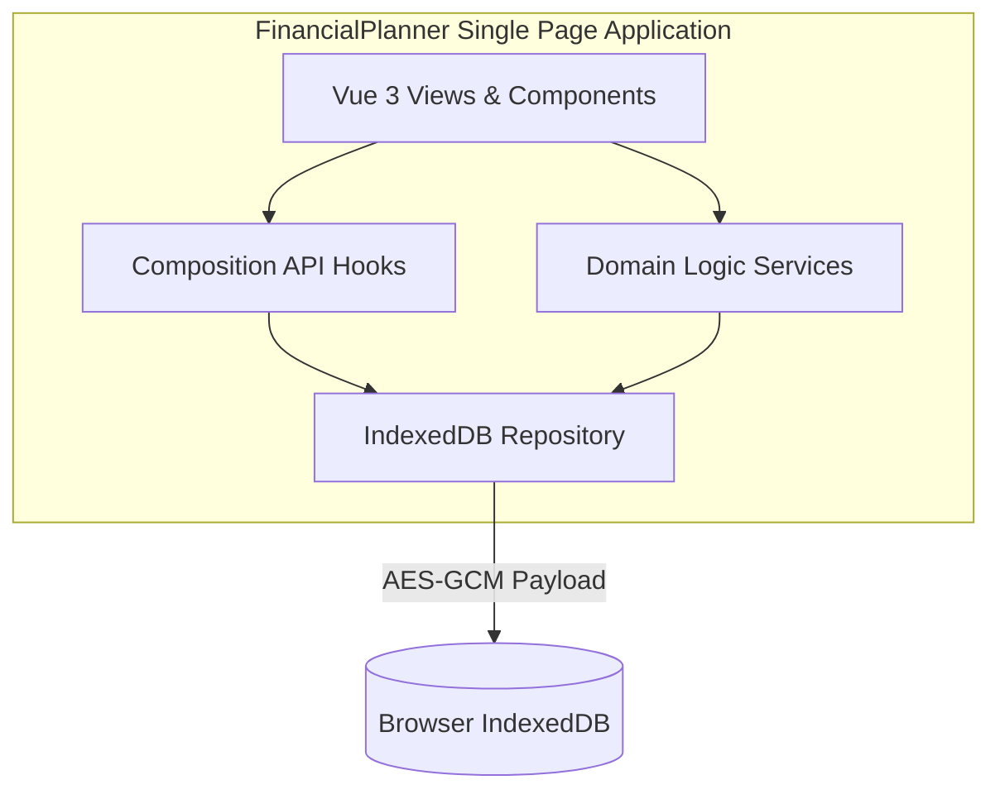
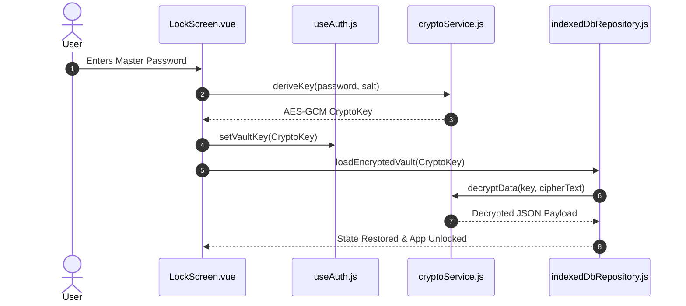
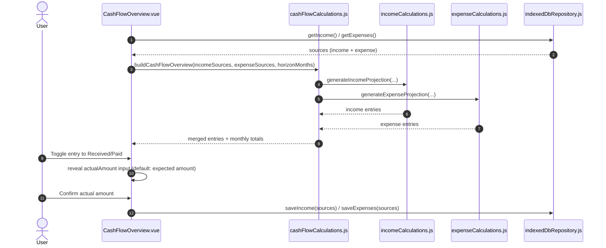
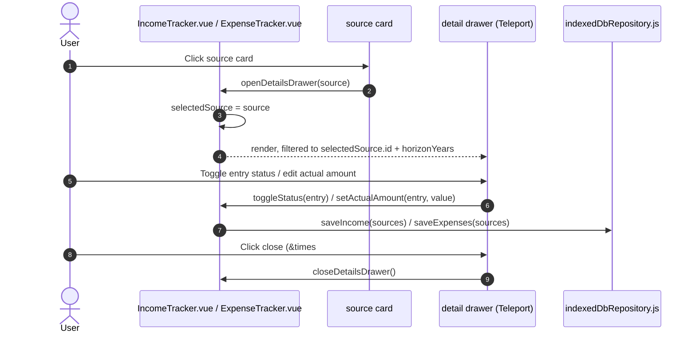

# Functional Design Document (FDD): FinancialPlanner

## 1. System Context Diagram (C4 Level 1)

---

## 2. Container Diagram (C4 Level 2)

---

## 3. Component Interactions & Sequence Flow

### 3.1 Vault Unlocking Sequence

---

### 3.2 Cash Flow Overview Entry Confirmation Sequence

---

### 3.3 Source Detail Drawer Sequence (Income/Expense Card Restyle)

---

## 4. Subsystem Functional Specifications

### 4.1 Compound Interest Calculation Engine
- **Module**: `src/services/financialCalculations.js`
- **Functions**: `calculateCompoundInterest`, `calculateRequiredMonthlyContribution`
- **Formula**:
  $$\text{Balance}_{m} = \text{Balance}_{m-1} \times (1 + r) + \text{PMT}_m$$
  where $\text{PMT}_m$ escalates annually by $(1 + \text{Increase}\%)$.

### 4.2 Loan & Installment Schedule Engine
- **Module**: [`src/services/loanCalculations.js`](../src/services/loanCalculations.js#L1-L119)
- **Functions**: `generateCreditCardInstallments`, `calculateCasualLoanSummary`, `calculateCreditLoanSummary`
- **Remainder Absorbance**: Floored base amounts are allocated across months, and division remainders are absorbed strictly into the final installment to avoid sub-cent floating point discrepancies ([`loanCalculations.js#L44-L47`](../src/services/loanCalculations.js#L44-L47)).
- **Due-Day Overflow**: The requested due day (1-31) is clamped to the last valid day of a given month (`Math.min(dueDay, maxDaysInMonth)`) rather than rolling into the next month, preserving the one-installment-per-month invariant ([`loanCalculations.js#L35-L37`](../src/services/loanCalculations.js#L35-L37)).
- **Data Model**: Casual and credit loans persist in a single array under one repository key, discriminated by `type: 'casual' | 'credit'`, rather than separate collections per loan kind ([`indexedDbRepository.js#L262-L273`](../src/services/indexedDbRepository.js#L262-L273)).
- **Schedule Edit Semantics**: Changing a credit loan's `totalAmount`, `installmentsCount`, `startMonth`, or `dueDay` fully regenerates the `installments` array via `generateCreditCardInstallments`, discarding any previously recorded `status`/`paymentDate`; the UI gates this behind a confirmation prompt ([`LoanTracker.vue#L666-L694`](../src/components/LoanTracker.vue#L666-L694)).
- **Lifecycle**: An `archived` boolean hides a loan from the default/active view and from aggregate stats without deleting it; a separate hard-delete action remains available regardless of archive state ([`LoanTracker.vue#L766-L773`](../src/components/LoanTracker.vue#L766-L773)).

### 4.3 Monthly Expense Registration & Projection Engine
- **Module**: `src/services/expenseCalculations.js` (new)
- **Functions**: `generateExpenseProjection`, `calculateMonthlyTotals` — mirroring [`generateIncomeProjection`](../src/services/incomeCalculations.js#L15-L54) and [`calculateMonthlyTotals`](../src/services/incomeCalculations.js#L62-L77) function-for-function, operating on expense sources instead of income sources.
- **Data Model**: An expense source is a recurring rule — `{ id, name, amount, type, startMonth ('YYYY-MM'), recurring }` — with no materialized per-month rows. The projection list is derived on read for the requested horizon, combined with a sparse status-override map keyed by `${sourceId}:${YYYY-MM}` (see [technical-decisions-monthly-income-tracker.md, TD-01](decisions/technical-decisions-monthly-income-tracker.md), reused unchanged per [ADR-004](adrs/ADR-004-expense-tracker-pattern-reuse.md)).
- **Recurrence**: Boolean `recurring` flag, monthly-only — a source with `recurring: true` produces one projected entry per month of the requested horizon starting at `startMonth`; a non-recurring source produces exactly one entry (TD-02, Decision: Option A, reused unchanged).
- **Category Label**: `type` is a free-text field (e.g., "Fixed bill", "Variable spending", "Subscription") used for display only; it does not affect projection derivation, mirroring income's `type` field ([`IncomeTracker.vue#L85-L86`](../src/components/IncomeTracker.vue#L85-L86)).
- **Default Status**: Every projected month defaults to `status: 'pending'` regardless of date; the user explicitly marks a month `paid` via the status-override map. No date-inferred "auto-paid" default is applied (TD-04, Decision: Option B, reused unchanged).
- **Horizon**: A user-selectable horizon control (short default, selectable up to 35 years / 420 months) drives the `horizonMonths` argument passed to `generateExpenseProjection`, reusing the grouped-list rendering pattern already used by `IncomeTracker.vue` (TD-03, Decision: Option B, reused unchanged).
- **Horizon anchoring (bug fix, 2026-09-15)**: `horizonMonths` is a forward-looking window counted from the *current* month, not from `startMonth`. Both `generateIncomeProjection` and `generateExpenseProjection` compute `monthsSinceStart` (months already elapsed between `startMonth` and the current month, floored at 0) and extend a recurring source's generated span to `horizonMonths + monthsSinceStart`, so every month from `startMonth` through today is always included in addition to the requested forward horizon. Previously the window was exactly `horizonMonths` months counted from `startMonth` only — for a source registered further in the past than the selected horizon, the window silently never reached the current month (or any future month at all). Both functions accept an optional `referenceDate` parameter (default `new Date()`) so this anchoring is deterministically testable; `endMonth` (above) still bounds the window unchanged regardless of the extension.
- **Persistence**: Expense sources and their status-override map persist under a new `EXPENSES_KEY` in [`indexedDbRepository.js`](../src/services/indexedDbRepository.js#L14-L19), following the same encrypted-blob-per-domain convention as `INCOME_KEY` and `LOANS_KEY`.
- **Recurring End Date** _(per [ADR-005](adrs/ADR-005-expense-recurring-end-date.md) / [technical-decisions-expense-recurring-end-date.md, TD-01](decisions/technical-decisions-expense-recurring-end-date.md))_: an optional `endMonth` (`'YYYY-MM'`, nullable) on the expense source shape. Absent/`null` `endMonth` preserves the horizon-driven behavior (recurs across the requested horizon, plus current-month catch-up). **Update (2026-09-15, per [ADR-010](adrs/ADR-010-income-recurring-end-date.md))**: this field is no longer expense-only — `generateIncomeProjection` and the income source shape gained the identical `endMonth` field, applied symmetrically. `IncomeTracker.vue`'s form, card badge, and parameter-change-reset guard all mirror `ExpenseTracker.vue`'s existing `endMonth` handling exactly. **Update (2026-09-15, per [ADR-011](adrs/ADR-011-bounded-source-full-span-projection.md))**: when `endMonth` is set, `horizonMonths` (and the current-month catch-up) is ignored entirely — the source always projects its complete `startMonth`-to-`endMonth` span, however long. Only unbounded (no `endMonth`) sources still use `horizonMonths + monthsSinceStart`.

### 4.4 Income/Expense Source Edit & Delete
- **Modules**: `src/components/IncomeTracker.vue`, `src/components/ExpenseTracker.vue`
- **Reference pattern**: [`src/components/LoanTracker.vue`](../src/components/LoanTracker.vue#L605-L764) (`editLoan` / `saveLoan` / `deleteLoan` / `confirmDeleteLoan`)
- **Edit** _(per [ADR-006](adrs/ADR-006-tracker-source-edit-delete.md) / [technical-decisions-tracker-source-edit-delete.md, TD-01](decisions/technical-decisions-tracker-source-edit-delete.md))_: an `editSource(source)` function populates the reactive `form` (keyed by `form.sourceId`) and reopens the existing add/edit modal. `saveSource()` branches on `form.sourceId` presence: when set, it updates the matching entry in `sources` in place; when absent, it pushes a new entry — mirroring [`saveLoan`](../src/components/LoanTracker.vue#L730-L745)'s `form.loanId` branch.
- **Delete**: a dedicated confirm modal (`showDeleteConfirm` + a `sourceToDelete` ref) gates removal; on confirm, the source is filtered out of `sources` and the array is persisted via `repository.saveIncome`/`repository.saveExpenses`. No native `window.confirm()` is used for this step.
- **Status-override reset on parameter edit** _(TD-02, Decision: Option B)_: when an edit changes `startMonth`, `recurring`, or `endMonth`, a [`ConfirmDialog`](../src/components/ConfirmDialog.vue) (`showParamsConfirm`, per [`dialog-implementation.md`](../.claude/rules/dialog-implementation.md)) warns the user that recorded paid/received statuses for that source will be cleared; on confirmation, `statusOverrides` is reset to `{}` before saving ([`IncomeTracker.vue#L220-L266`](../src/components/IncomeTracker.vue#L220-L266)) — mirroring [`updateExistingLoan`'s parameter-change guard](../src/components/LoanTracker.vue#L677-L694). Editing only `name`, `type`, or `amount` does not trigger this reset.

### 4.5 Editable Actual Amounts & Consolidated Cash Flow Overview
- **Modules**: `src/services/incomeCalculations.js`, `src/services/expenseCalculations.js`, `src/services/cashFlowCalculations.js` (new), `src/components/IncomeTracker.vue`, `src/components/ExpenseTracker.vue`, `src/components/CashFlowOverview.vue` (new), [`src/App.vue`](../src/App.vue#L130-L132)
- **Reference pattern**: [`src/components/InvestmentTimeline.vue`](../src/components/InvestmentTimeline.vue#L122-L147) (`stateMap[item.id] = { checked, actualValue }`, legacy-shape migration, `saveState()`)
- **Actual amount storage** _(per [ADR-007](adrs/ADR-007-cash-flow-overview.md) / [technical-decisions-cash-flow-overview.md, TD-01](decisions/technical-decisions-cash-flow-overview.md))_: `statusOverrides[month]` is upgraded from a plain string to `{ status: 'received' | 'pending' | 'paid', actualAmount: number | null }`. Every read site treats a `typeof value === 'string'` entry as `{ status: value, actualAmount: null }` for backward compatibility with Phase 7/8 persisted data — no destructive migration is run. `generateIncomeProjection`/`generateExpenseProjection` resolve each entry's `amount` field to `actualAmount` when present and status is received/paid, else fall back to the source's registered expected amount; `calculateMonthlyTotals` sums whichever value each entry resolved to.
- **Actual amount UI**: toggling an entry to Received/Paid reveals an editable numeric input for that entry, defaulting to the source's expected amount (same default behavior as `InvestmentTimeline.vue`'s `actualValue`); the value is persisted on blur via `repository.saveIncome`/`repository.saveExpenses`, mirroring Timeline's `@blur="saveState"`.
- **Cash Flow Overview composition** _(TD-02, Decision: Option A)_: `cashFlowCalculations.js` exports a pure function that takes income sources, expense sources, and a horizon, calls `generateIncomeProjection`/`generateExpenseProjection`, tags each resulting entry with `kind: 'income' | 'expense'`, merges and sorts them by `month`, and derives combined per-month totals across both domains. `CashFlowOverview.vue` reads sources directly via `repository.getIncome()`/`repository.getExpenses()`, independent of whether the Income Tracker or Expense Tracker tabs have been opened in the current session.
- **Combined monthly totals (bug fix, 2026-09-15, BUGFIX-002)**: `calculateCombinedMonthlyTotals` returns `{ received, paid, pending, pendingIncome, pendingExpense, net }`. `net` is `(received + pendingIncome) - (paid + pendingExpense)` — income minus expenses. Previously the returned `total` field summed every entry regardless of kind (`pending + paid + received`), which for a merged income+expense list is effectively income-plus-expenses, not a cash-flow figure. The UI's month header now shows "Net" (`.total-net`, styled with the `negative` class — red — when below zero) in place of the old "Total".
- **Cash Flow Overview interactivity** _(TD-03, Decision: Option B)_: each row in the merged list exposes the same status-toggle and actual-amount edit controls as the owning tracker; committing a change from this screen updates the corresponding source's `statusOverrides` entry and persists through `repository.saveIncome`/`repository.saveExpenses`, keyed by the entry's `kind` to route the write to the correct repository method.
- **Navigation**: `App.vue` adds a `cashFlow` tab rendering `CashFlowOverview.vue`, following the existing `v-else-if="activeTab === '...'"` pattern used for `loans`/`income`/`expenses` ([`App.vue#L130-L132`](../src/App.vue#L130-L132)).
- **Horizon control** _(per [ADR-013](adrs/ADR-013-cashflow-horizon-ruler-slider.md), 2026-09-15)_: `CashFlowOverview.vue`'s original horizon `<select>` (1/5/10/35 years) is replaced with the identical month-granularity ruler slider used by `IncomeTracker.vue`/`ExpenseTracker.vue` (§4.7) — `horizonMonths` ref, `min="1" max="420" step="1"`, passed directly to `buildCashFlowEntries` with no unit conversion. Reuses the `cashFlow.horizonMonths` i18n key (replacing the removed `cashFlow.horizonYears`). **Update (2026-09-15, per [ADR-015](adrs/ADR-015-default-horizon-current-month-only.md))**: default lowered from `3` to `1`, so the screen opens scoped to the current month only, same as §4.7.

### 4.6 Income/Expense Tracker Card & Drawer Restyle
- **Modules**: `src/components/IncomeTracker.vue`, `src/components/ExpenseTracker.vue`
- **Reference pattern**: [`src/components/LoanTracker.vue`](../src/components/LoanTracker.vue#L1-L1681) (stats dashboard `.stats-grid`/`.stat-card`, card grid `.loans-grid`/`.loan-card` with hover `.card-actions`, detail drawer `.drawer-overlay`/`.drawer-panel`)
- **Stats dashboard** _(per [ADR-008](adrs/ADR-008-income-expense-card-restyle.md))_: a `.stats-grid` row above the card grid, mirroring [`LoanTracker.vue`'s `stats` computed](../src/components/LoanTracker.vue#L547-L572). Income shows total expected / received / pending (summed across `projectionEntries` for the selected `horizonYears`) plus a registered-sources count; Expense shows the same with paid in place of received.
- **Card grid**: the always-visible `.income-entry-row`/`.expense-entry-row` source list is replaced by a card grid (one `.loan-card`-equivalent per source), each card showing the source's name, type, and amount, with hover-revealed `.card-actions` (edit/delete icon buttons, mirroring [`LoanTracker.vue#L134-L146`](../src/components/LoanTracker.vue#L134-L146)) and a click handler (guarded with `.stop` on the action icons, mirroring [`LoanTracker.vue#L84`](../src/components/LoanTracker.vue#L84)/[`#L135`](../src/components/LoanTracker.vue#L135)) that opens the source's detail drawer.
- **Detail drawer**: a `Teleport`-based slide-in panel (`showDetailsDrawer` + `selectedSource`, mirroring [`LoanTracker.vue#L296-L440`](../src/components/LoanTracker.vue#L296-L440)) renders only the entries belonging to `selectedSource.id`, grouped by year/month exactly as the removed combined list was, reusing the existing `toggleStatus`/`displayActualAmount`/`setActualAmount` functions (per [ADR-007](adrs/ADR-007-cash-flow-overview.md)) unchanged. See [§3.3 Source Detail Drawer Sequence](#33-source-detail-drawer-sequence-incomeexpense-card-restyle).
- **Horizon selector**: remains a top-level control (unchanged location); it now drives both the stats dashboard and whichever drawer is currently open, since opening a drawer does not reset or override the tracker's selected horizon.
- **Add/Edit modal and `ConfirmDialog`s**: unchanged — both trackers already share `LoanTracker.vue`'s `.modal-overlay`/`.modal-content` shape and `ConfirmDialog.vue` component (per [ADR-006](adrs/ADR-006-tracker-source-edit-delete.md)).
- **Explicitly not adopted**: `LoanTracker.vue`'s `active`/`completed`/`archived`/`all` filter tabs are not carried over — income/expense sources have no equivalent lifecycle concept (see RFC § Open Questions / Future Roadmap).

### 4.7 Income/Expense Horizon Ruler Slider
- **Modules**: `src/components/IncomeTracker.vue`, `src/components/ExpenseTracker.vue`
- **Reference pattern**: [`src/components/PortfolioTracker.vue`](../src/components/PortfolioTracker.vue#L7-L32) (`.horizon-ruler-container` / `.ruler-wrapper` / `input[type="range"].ruler-slider` / `.ruler-ticks` / pill badge)
- **Control** _(per [ADR-009](adrs/ADR-009-horizon-ruler-slider.md))_: the horizon `<select>` is replaced by `input[type="range"]` bound to a horizon ref (`v-model.number`).
- **Month granularity** _(per [ADR-012](adrs/ADR-012-month-granularity-horizon-slider.md), 2026-09-15)_: the ref is `horizonMonths` (months, not years), `min="1" max="420" step="1"` — 420 months = 35 years, preserving the ceiling already decided in `monthly-income-tracker/TD-03`, but every month position is now reachable (previously the slider jumped a full 12 months per step). `horizonMonths.value` is passed directly to `generateIncomeProjection`/`generateExpenseProjection` with no `* 12` conversion. Default was lowered from `12` to `3` months here, then further lowered to `1` (see the ADR-015 update below). The pill badge shows `{horizonMonths} month(s) / {Mon YYYY}` (the resulting month/year, via `Intl.DateTimeFormat({month: 'short', year: 'numeric'})`), reusing a new `income.horizonMonths`/`expenses.horizonMonths` i18n key (replacing the old `horizonYears` key for these two trackers; `CashFlowOverview.vue`'s own separate `cashFlow.horizonYears`-keyed `<select>` is unaffected — out of scope per ADR-008). Tick marks stay at 8 evenly-spaced points (`0, 60, 120, ..., 420` months = every 5 years) since month-level tick labels would be unreadable at this scale; the slider itself still steps 1 month at a time between ticks.
- **Interaction with bounded sources**: per [ADR-011](adrs/ADR-011-bounded-source-full-span-projection.md), this control only affects sources with no `endMonth` — a bounded source ignores it and always shows its full span.
- **Stats dashboard (§4.6)**: **Update (2026-09-15, per [ADR-014](adrs/ADR-014-stats-dashboard-horizon-window-scoping.md))**: no longer aggregates every entry `projectionEntries` returns. A new `statsEntries` computed filters to `[currentMonth, currentMonth + horizonMonths - 1]` — the literal ruler-selected window — before feeding `calculateMonthlyTotals`, so catch-up backlog (§4.3's horizon-anchoring bug fix) and a bounded source's full-span overflow (ADR-011) no longer inflate the stats dashboard's figures. The detail drawer (§4.6) is unaffected and still reads the unfiltered `projectionEntries`.
- **Default value (2026-09-15, per [ADR-015](adrs/ADR-015-default-horizon-current-month-only.md))**: `horizonMonths` now initializes to `1` (was `3`), so `IncomeTracker.vue`, `ExpenseTracker.vue`, and `CashFlowOverview.vue` (§4.5) all open scoped to the current month only. Combined with the ADR-014 update above, the stats dashboard's first-paint figures reflect exactly the current month's entries.
