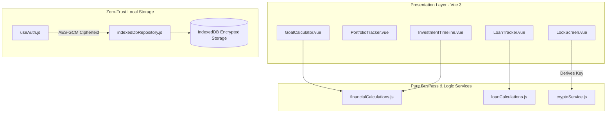

# Technical Proposal / Request for Comments (RFC): FinancialPlanner Architecture

## 1. Context & Motivation
Financial planning tools often require transmitting sensitive personal wealth data to remote cloud servers. **FinancialPlanner** addresses this security liability by operating strictly in the browser runtime, combining Vue 3 reactive UI state with Web Crypto API encryption and IndexedDB local storage.

---

## 2. Proposed Architecture & System Design

### 2.1 Technology Stack & Architectural Layers
- **UI Framework**: Vue 3 (Composition API with `<script setup>`)
- **Build System**: Vite 8.x
- **Testing Engine**: Vitest 4.x with `@vue/test-utils` and `jsdom`
- **Encryption Subsystem**: Web Crypto API (`window.crypto.subtle`)
- **Persistence Engine**: IndexedDB with LocalStorage fallback options

---

## 3. Detailed Component Breakdown

---

## 4. Key Engineering Decisions & Trade-Offs

### 4.1 Client-Side PBKDF2 + AES-GCM Key Derivation
- **Decision**: Derive a 256-bit AES-GCM key from the master password using PBKDF2 with 100,000 SHA-256 iterations and a dedicated salt.
- **Trade-off**: Slightly higher CPU initialization overhead on vault unlock in exchange for uncompromised zero-knowledge security.

### 4.2 Separation of Pure Calculations from Vue Views
- **Decision**: Keep mathematical formulas and compound interest loops in `src/services/` free from Vue reactivity or DOM dependencies.
- **Trade-off**: Requires explicit passing of parameters from components to service functions, but enables fast, isolated unit testing.

### 4.3 Loan Tracker: Unified Collection with Type Discriminator, Full Regenerate on Schedule Edit
- **Decision**: Casual friend loans and credit card installment loans persist as a single array under one repository key ([`indexedDbRepository.js`](../src/services/indexedDbRepository.js#L14-L17)), discriminated by a `type` field, following the same one-key-per-domain convention already used for investments, goals, timeline, and income. Editing a credit loan's schedule parameters (amount, installment count, start month, due day) fully regenerates [`generateCreditCardInstallments`](../src/services/loanCalculations.js#L15-L59)'s output behind a confirmation prompt, rather than attempting to merge/preserve prior installment statuses.
- **Trade-off**: Keeps schedule generation a single deterministic function of its parameters and avoids forking the storage layer per loan kind, at the cost of discarding recorded payment history if a user edits schedule parameters after marking installments paid (mitigated by the confirmation prompt). See [ADR-003](adrs/ADR-003-loan-tracker-pattern-reuse.md) and [technical-decisions-loan-tracker-and-schedules.md](decisions/technical-decisions-loan-tracker-and-schedules.md) for the full alternatives considered.

### 4.4 Expense Tracker: Reuse of Income Tracker's Derived-Projection Model
- **Decision**: Expense sources persist only a recurring rule (amount, start month, `recurring` flag, free-text `type` label) plus a sparse status-override map; the paid/pending month-by-month projection is derived on read by a pure function mirroring [`generateIncomeProjection`](../src/services/incomeCalculations.js#L15-L54), reusing a new `EXPENSES_KEY` under the same one-key-per-domain repository convention ([`indexedDbRepository.js`](../src/services/indexedDbRepository.js#L14-L19)). No new projection model, cadence representation, or default-status policy was introduced — Phase 8 inherits Phase 7's decisions in full.
- **Trade-off**: Avoids materializing up to 420 monthly rows per recurring source (the loan-installment alternative) at the cost of inheriting the same monthly-only recurrence limitation income already accepted (quarterly/annual bills need separate one-off entries). See [ADR-004](adrs/ADR-004-expense-tracker-pattern-reuse.md) and [technical-decisions-monthly-income-tracker.md](decisions/technical-decisions-monthly-income-tracker.md) for the full alternatives considered.

### 4.5 Recurring Expense End Date: Optional `endMonth`, Expense-Only Divergence
- **Decision**: [`generateExpenseProjection`](../src/services/expenseCalculations.js#L15-L54) accepts an optional `endMonth` (`'YYYY-MM'`, nullable) on each expense source; when set, the projection loop stops generating entries once the computed month exceeds it, in addition to the existing `horizonMonths` bound. The field mirrors `startMonth`'s existing string shape and `<input type="month">` control. The income tracker's model (`monthly-income-tracker/TD-02`) is not reopened — this capability was requested for expenses only.
- **Trade-off**: Keeps the change to one nullable field and one extra loop bound (fully backward-compatible — sources without `endMonth` are unaffected) at the cost of a small, intentional asymmetry between the two trackers (documented so it reads as deliberate, not an oversight). See [ADR-005](adrs/ADR-005-expense-recurring-end-date.md) and [technical-decisions-expense-recurring-end-date.md](decisions/technical-decisions-expense-recurring-end-date.md) for the full alternatives considered.

### 4.6 Income/Expense Source Edit & Delete: Reuse of Loan Tracker Interaction Pattern
- **Decision**: Both `IncomeTracker.vue` and `ExpenseTracker.vue` gain `editSource`/`saveSource`/`deleteSource`/`confirmDeleteSource` functions mirroring [`LoanTracker.vue`'s already-proven shape](../src/components/LoanTracker.vue#L605-L764) — a populated add-modal for edit (keyed by `form.sourceId`), a dedicated confirm modal for delete. Editing `startMonth`, `recurring`, or `endMonth` discards the source's `statusOverrides` map after a `ConfirmDialog` warning, mirroring [`updateExistingLoan`'s parameter-change guard](../src/components/LoanTracker.vue#L677-L694); editing `name`/`type`/`amount` alone does not.
- **Trade-off**: Introduces no new interaction pattern (every edit/delete flow in the app becomes consistent) at the cost of discarding a source's recorded paid/received history whenever its recurrence parameters change, even for a simple date-typo fix — an explicit trade-off the user chose in favor of consistency with the loan precedent over data preservation. See [ADR-006](adrs/ADR-006-tracker-source-edit-delete.md) and [technical-decisions-tracker-source-edit-delete.md](decisions/technical-decisions-tracker-source-edit-delete.md) for the full alternatives considered.

---

### 4.7 Editable Actual Amounts & Consolidated Cash Flow Overview
- **Decision**: `statusOverrides[month]` on income/expense sources is upgraded from a plain string to `{ status, actualAmount }`, with a read-time fallback treating any legacy string value as `{ status: value, actualAmount: null }` — mirroring the migration [`InvestmentTimeline.vue`](../src/components/InvestmentTimeline.vue#L122-L126) already performs for its own `stateMap` shape. Marking an entry received/paid reveals an editable actual-amount input (default: the entry's expected `amount`), and the persisted actual amount feeds monthly totals in place of the expected amount, mirroring Timeline's `actualValue` pattern ([`InvestmentTimeline.vue#L122-L147`](../src/components/InvestmentTimeline.vue#L122-L147)). A new pure service module `src/services/cashFlowCalculations.js` merges `generateIncomeProjection`/`generateExpenseProjection` output and derives combined monthly Pending/Paid/Received totals; the new `CashFlowOverview.vue` screen (wired into `App.vue` as a new tab) is fully interactive, duplicating the status-toggle and actual-amount edit controls per row so a user can correct either domain without leaving the screen. See [ADR-007](adrs/ADR-007-cash-flow-overview.md).

---

### 4.8 Income/Expense Tracker Card & Drawer Restyle
- **Decision**: `IncomeTracker.vue` and `ExpenseTracker.vue` are restyled to match [`LoanTracker.vue`](../src/components/LoanTracker.vue#L1-L1681)'s established visual pattern: a stats dashboard row, registered sources as a card grid with hover-revealed edit/delete icons, and a per-source `Teleport` slide-in detail drawer (opened by clicking a card) showing that source's own month-by-month projection with the existing status-toggle and actual-amount editing controls. The single combined projection list previously rendered inline below the source list is removed from both trackers. The horizon selector remains a top-level control feeding both the stats dashboard and whichever drawer is open. No filter tabs (active/completed/archived/all) are adopted — income/expense sources have no equivalent lifecycle concept. The Cash Flow Overview screen (§4.7) is unaffected and keeps its combined list layout. See [ADR-008](adrs/ADR-008-income-expense-card-restyle.md).

### 4.9 Income/Expense Horizon Ruler Slider
- **Decision**: the horizon `<select>` dropdown in `IncomeTracker.vue`/`ExpenseTracker.vue` (§4.8) is replaced with a ruler-slider input reusing [`PortfolioTracker.vue`'s existing horizon slider](../src/components/PortfolioTracker.vue#L7-L32) markup and styling, capped at the trackers' existing 35-year ceiling (`min="1" max="35"`) rather than Portfolio's 50-year range, with denser 5-year tick marks. The underlying `horizonYears` value, its default, and its effect on `generateIncomeProjection`/`generateExpenseProjection` are unchanged — only the input widget changes. See [ADR-009](adrs/ADR-009-horizon-ruler-slider.md).

### 4.10 Recurring Income End Date
- **Decision**: income sources gain the identical optional `endMonth` (`'YYYY-MM'`, nullable, inclusive) field already shipped for expense sources — same representation, same `generateIncomeProjection` loop bound, same form field, same status-override reset on parameter edit. No new technical decision was made; Option A of `technical-decisions-expense-recurring-end-date.md` TD-01 is reused verbatim, applied symmetrically to the income side. See [ADR-010](adrs/ADR-010-income-recurring-end-date.md).

### 4.11 Bounded Sources Always Project Their Full Start-to-End Span
- **Decision**: a recurring source with `endMonth` set now ignores the horizon slider (and the current-month catch-up extension) entirely — it always projects every month from `startMonth` through `endMonth`, however long that span is. Previously a bounded source could be truncated at the selected horizon before reaching its own end date. Sources with no `endMonth` are unaffected and keep using the horizon slider as before, since they have no natural bound of their own. See [ADR-011](adrs/ADR-011-bounded-source-full-span-projection.md).

### 4.12 Horizon Slider Steps Month by Month
- **Decision**: the horizon ruler slider (§4.9) is re-based from years (`1`-`35`, step 1 year) to months (`1`-`420`, step 1 month), passed directly to `generateIncomeProjection`/`generateExpenseProjection` with no unit conversion. The default value drops from 12 months (1 year) to a near-term default (further lowered by §4.15/ADR-015), so opening a tracker shows a near-term view by default. This only affects unbounded sources (§4.11 already makes bounded sources ignore the slider). See [ADR-012](adrs/ADR-012-month-granularity-horizon-slider.md).

### 4.13 Cash Flow Overview Horizon Ruler Slider
- **Decision**: `CashFlowOverview.vue`'s horizon `<select>` (the one tracker left with the original dropdown) is replaced with the identical month-granularity ruler slider from §4.12, not Portfolio's year-based one — since it shares Income/Expense's monthly data domain. `horizonMonths.value` is passed directly to `buildCashFlowEntries`; no other behavior changes. See [ADR-013](adrs/ADR-013-cashflow-horizon-ruler-slider.md).

### 4.14 Stats Dashboard Scoped to the Selected Horizon Window
- **Decision**: `IncomeTracker.vue`/`ExpenseTracker.vue`'s stats dashboard (§4.6) now aggregates only entries within `[currentMonth, currentMonth + horizonMonths - 1]` — the literal ruler-selected window — instead of every entry `projectionEntries` returns. Previously the stats summed catch-up backlog (BUGFIX-001) and a bounded source's full overflow beyond the horizon (§4.11/ADR-011), so narrowing the ruler didn't actually narrow the stats. The drawer is unaffected — it still shows the full unfiltered projection so old backlog and bounded sources' complete spans remain reviewable. See [ADR-014](adrs/ADR-014-stats-dashboard-horizon-window-scoping.md).

### 4.15 Projection Horizon Defaults to the Current Month Only
- **Decision**: the `horizonMonths` ref's initial value is lowered from `3` to `1` across `IncomeTracker.vue`, `ExpenseTracker.vue`, and `CashFlowOverview.vue` (§4.9/§4.13), so each screen opens scoped to exactly the current month. Combined with §4.14's windowing, the stats dashboard's first-paint figures reflect only the current month's entries. The ruler's range/step (§4.12) are unchanged — only the default selection moves. See [ADR-015](adrs/ADR-015-default-horizon-current-month-only.md).

### 4.16 Dependency Deprecation Pin (`glob`)
- **Decision**: `npm install` printed a `glob@10.5.0` deprecation warning at deploy time, transitively required by `@vue/test-utils → js-beautify`. A top-level `"overrides": { "glob": "^13.0.6" }` in `package.json` forces every transitive `glob` resolution to a current, non-deprecated version without bumping `js-beautify`'s major (which would pull a `nopt` version requiring a newer Node than the deploy image supported at the time). See BUGFIX-004 in [TRACKER.md](TRACKER.md#bug-fix-traceability).

### 4.17 Full Dependency & Runtime Upgrade (Phase 11)
- **Decision**: every project dependency is bumped to its latest compatible release — `vue`, `vite`, `@vitejs/plugin-vue` within their current majors, and `vitest`/`@vitest/coverage-v8` (major 4→5) and `jsdom` (major 29→30) to their new majors — and the Node runtime the project builds/deploys against moves from `node:20-alpine` to `node:24-alpine` (the current Active/Maintenance LTS line), which `vitest@5`/`jsdom@30` both require. `@vue/test-utils` is deliberately held at `^2.4.6` rather than bumped to `2.5.0`, since that would reintroduce the Node-engine constraint §4.16's `glob` override was written to avoid — this time in a way the Node runtime upgrade can't fully close, because a developer's local Node version is outside this project's control. See [ADR-016](adrs/ADR-016-full-dependency-and-runtime-upgrade.md).

---

## 5. Open Questions / Future Roadmap
- **Generic recurrence interval**: income tracker TD-02 recommended (but did not decide) a generic `repeatEveryMonths` integer field over the current monthly-only boolean flag; revisiting this would let both income and expense sources represent quarterly/semi-annual/annual recurrence natively instead of as repeated one-off entries. Deferred, not part of Phase 7 or Phase 8 scope.
- **Expense category taxonomy**: the current free-text `type` label (mirrored from income) has no fixed enum or reporting/filtering by category (fixed bill vs. variable spending vs. subscription). A structured category system, if ever needed for budgeting/reporting features, is out of scope for Phase 8 and deferred to a future phase.
- **Legacy `statusOverrides` migration sweep**: Phase 9's read-time fallback (§4.7) lets old string-shaped override values coexist indefinitely with the new `{status, actualAmount}` object shape. A one-time migration to normalize all persisted sources to the new shape (removing the fallback branch from every reader) is deferred — not part of Phase 9 scope.
- **Income/Expense source lifecycle (archive/complete) and filter tabs**: `LoanTracker.vue`'s `active`/`completed`/`archived`/`all` filter tabs (§4.8) were deliberately not adopted for Income/Expense sources, which have no equivalent lifecycle concept today. If a future need arises (e.g., decluttering long-ended recurring sources), introducing an archive flag and matching filter tabs is deferred, not part of Phase 10 scope.
