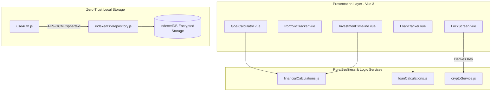

# Technical Proposal / Request for Comments (RFC): FinancialPlanner Architecture

## 1. Context & Motivation
Financial planning tools often require transmitting sensitive personal wealth data to remote cloud servers. **FinancialPlanner** addresses this security liability by operating strictly in the browser runtime, combining Vue 3 reactive UI state with Web Crypto API encryption and IndexedDB local storage.

---

## 2. Proposed Architecture & System Design

### 2.1 Technology Stack & Architectural Layers
- **UI Framework**: Vue 3 (Composition API with `<script setup>`)
- **Build System**: Vite 8.x
- **Testing Engine**: Vitest 4.x with `@vue/test-utils` and `jsdom`
- **Encryption Subsystem**: Web Crypto API (`window.crypto.subtle`)
- **Persistence Engine**: IndexedDB with LocalStorage fallback options

---

## 3. Detailed Component Breakdown

---

## 4. Key Engineering Decisions & Trade-Offs

### 4.1 Client-Side PBKDF2 + AES-GCM Key Derivation
- **Decision**: Derive a 256-bit AES-GCM key from the master password using PBKDF2 with 100,000 SHA-256 iterations and a dedicated salt.
- **Trade-off**: Slightly higher CPU initialization overhead on vault unlock in exchange for uncompromised zero-knowledge security.

### 4.2 Separation of Pure Calculations from Vue Views
- **Decision**: Keep mathematical formulas and compound interest loops in `src/services/` free from Vue reactivity or DOM dependencies.
- **Trade-off**: Requires explicit passing of parameters from components to service functions, but enables fast, isolated unit testing.
