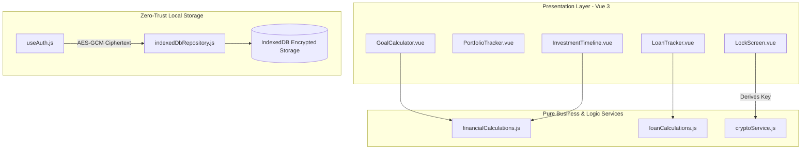

# Technical Proposal / Request for Comments (RFC): FinancialPlanner Architecture

## 1. Context & Motivation
Financial planning tools often require transmitting sensitive personal wealth data to remote cloud servers. **FinancialPlanner** addresses this security liability by operating strictly in the browser runtime, combining Vue 3 reactive UI state with Web Crypto API encryption and IndexedDB local storage.

---

## 2. Proposed Architecture & System Design

### 2.1 Technology Stack & Architectural Layers
- **UI Framework**: Vue 3 (Composition API with `<script setup>`)
- **Build System**: Vite 8.x
- **Testing Engine**: Vitest 4.x with `@vue/test-utils` and `jsdom`
- **Encryption Subsystem**: Web Crypto API (`window.crypto.subtle`)
- **Persistence Engine**: IndexedDB with LocalStorage fallback options

---

## 3. Detailed Component Breakdown

---

## 4. Key Engineering Decisions & Trade-Offs

### 4.1 Client-Side PBKDF2 + AES-GCM Key Derivation
- **Decision**: Derive a 256-bit AES-GCM key from the master password using PBKDF2 with 100,000 SHA-256 iterations and a dedicated salt.
- **Trade-off**: Slightly higher CPU initialization overhead on vault unlock in exchange for uncompromised zero-knowledge security.

### 4.2 Separation of Pure Calculations from Vue Views
- **Decision**: Keep mathematical formulas and compound interest loops in `src/services/` free from Vue reactivity or DOM dependencies.
- **Trade-off**: Requires explicit passing of parameters from components to service functions, but enables fast, isolated unit testing.

### 4.3 Loan Tracker: Unified Collection with Type Discriminator, Full Regenerate on Schedule Edit
- **Decision**: Casual friend loans and credit card installment loans persist as a single array under one repository key ([`indexedDbRepository.js`](../src/services/indexedDbRepository.js#L14-L17)), discriminated by a `type` field, following the same one-key-per-domain convention already used for investments, goals, timeline, and income. Editing a credit loan's schedule parameters (amount, installment count, start month, due day) fully regenerates [`generateCreditCardInstallments`](../src/services/loanCalculations.js#L15-L59)'s output behind a confirmation prompt, rather than attempting to merge/preserve prior installment statuses.
- **Trade-off**: Keeps schedule generation a single deterministic function of its parameters and avoids forking the storage layer per loan kind, at the cost of discarding recorded payment history if a user edits schedule parameters after marking installments paid (mitigated by the confirmation prompt). See [ADR-003](adrs/ADR-003-loan-tracker-pattern-reuse.md) and [technical-decisions-loan-tracker-and-schedules.md](decisions/technical-decisions-loan-tracker-and-schedules.md) for the full alternatives considered.

### 4.4 Expense Tracker: Reuse of Income Tracker's Derived-Projection Model
- **Decision**: Expense sources persist only a recurring rule (amount, start month, `recurring` flag, free-text `type` label) plus a sparse status-override map; the paid/pending month-by-month projection is derived on read by a pure function mirroring [`generateIncomeProjection`](../src/services/incomeCalculations.js#L15-L54), reusing a new `EXPENSES_KEY` under the same one-key-per-domain repository convention ([`indexedDbRepository.js`](../src/services/indexedDbRepository.js#L14-L19)). No new projection model, cadence representation, or default-status policy was introduced — Phase 8 inherits Phase 7's decisions in full.
- **Trade-off**: Avoids materializing up to 420 monthly rows per recurring source (the loan-installment alternative) at the cost of inheriting the same monthly-only recurrence limitation income already accepted (quarterly/annual bills need separate one-off entries). See [ADR-004](adrs/ADR-004-expense-tracker-pattern-reuse.md) and [technical-decisions-monthly-income-tracker.md](decisions/technical-decisions-monthly-income-tracker.md) for the full alternatives considered.

---

## 5. Open Questions / Future Roadmap
- **Generic recurrence interval**: income tracker TD-02 recommended (but did not decide) a generic `repeatEveryMonths` integer field over the current monthly-only boolean flag; revisiting this would let both income and expense sources represent quarterly/semi-annual/annual recurrence natively instead of as repeated one-off entries. Deferred, not part of Phase 7 or Phase 8 scope.
- **Expense category taxonomy**: the current free-text `type` label (mirrored from income) has no fixed enum or reporting/filtering by category (fixed bill vs. variable spending vs. subscription). A structured category system, if ever needed for budgeting/reporting features, is out of scope for Phase 8 and deferred to a future phase.
