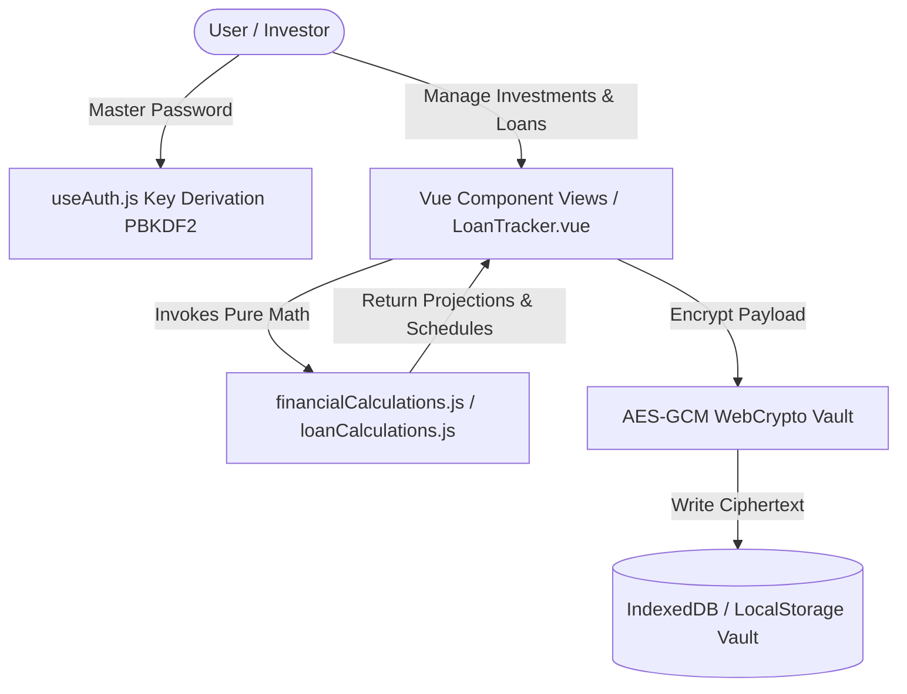

# Architectural Specification: FinancialPlanner

## 1. System Layers & Component Contracts

| Layer | Component / Module | Responsibility |
|---|---|---|
| **Presentation (UI)** | `src/components/*.vue` | Vue 3 Composition API `<script setup>` views (`PortfolioTracker`, `LoanTracker`, `GoalCalculator`, `PastInvestmentSimulator`, `TimeGapComparator`, `InvestmentTimeline`) |
| **Reactivity Hooks** | `src/composables/*.js` | Reactive state management (`useAuth`, `useI18n`, `useStorage`) |
| **Business Services** | `src/services/*.js` | Pure calculation functions (`financialCalculations.js`, `loanCalculations.js`) |
| **Security Vault** | `window.crypto.subtle` | Web Crypto API PBKDF2 key derivation and AES-GCM cipher encryption |
| **Persistence** | `IndexedDB` & `LocalStorage` | Client-side persistent storage of encrypted ciphertext (`indexedDbRepository.js`, `localStorageRepository.js`) |

---

## 2. Reverse-Engineered System Data Flow

---

## 3. Subsystem Architecture: Loans & Installment Scheduling

### 3.1 Casual Friend Loans
- **Engine**: `calculateCasualLoanSummary(loan)` in `src/services/loanCalculations.js`.
- **Logic**: Sums partial repayments, computes net remaining balance, and determines progress percentage against initial principal lent.

### 3.2 Credit Limit Loans & Installment Schedules
- **Engine**: `generateCreditCardInstallments(totalAmount, count, startMonth, dueDay)` and `calculateCreditLoanSummary(loan)`.
- **Remainder Absorbance**: Floored base amounts are allocated across months, and division remainders are absorbed strictly into the final installment to avoid sub-cent floating point discrepancies.
- **Date Protection**: Clamps payment due days to valid max days per month (e.g. Day 31 in June clamps to June 30, February leap years are respected via `new Date(year, month, 0).getDate()`).

---

## 4. Security & Zero-Trust Guardrails
- Data stored on disk is ALWAYS ciphertext (`AES-GCM`).
- Unencrypted Master Password key exists ONLY in volatile RAM state (`useAuth.js`).
- Never use `v-html` to prevent XSS attacks.
