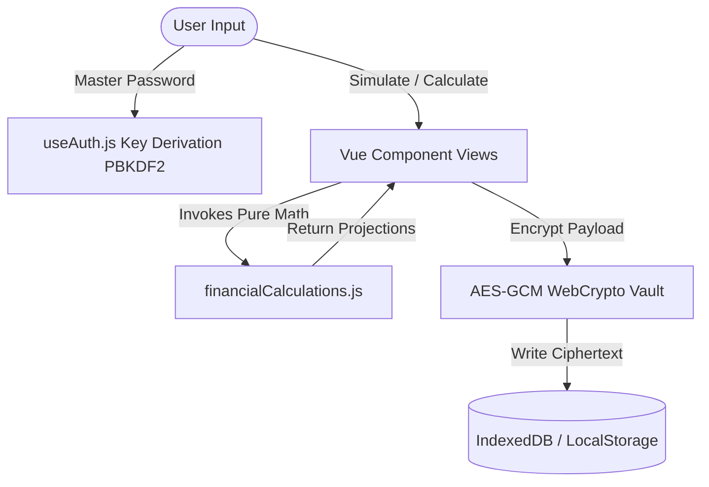

# Architectural Specification: FinancialPlanner

## 1. System Layers & Component Contracts

| Layer | Component / Module | Responsibility |
|---|---|---|
| **Presentation (UI)** | `src/components/*.vue` | Vue 3 Composition API `<script setup>` views, user inputs, i18n formatting |
| **Reactivity Hooks** | `src/composables/*.js` | Reactive state management (`useAuth`, `useI18n`, `useStorage`) |
| **Business Services** | `src/services/*.js` | Pure calculation functions (`financialCalculations.js`, `loanCalculations.js`) |
| **Security Vault** | `window.crypto.subtle` | Web Crypto API PBKDF2 key derivation and AES-GCM cipher encryption |
| **Persistence** | `IndexedDB` & `LocalStorage` | Client-side persistent storage of encrypted ciphertext |

---

## 2. Reverse-Engineered System Data Flow

---

## 3. Security & Zero-Trust Guardrails
- Data stored on disk is ALWAYS ciphertext (`AES-GCM`).
- Unencrypted Master Password exists ONLY in volatile RAM state (`useAuth.js`).
- Never use `v-html` to prevent XSS attacks.
